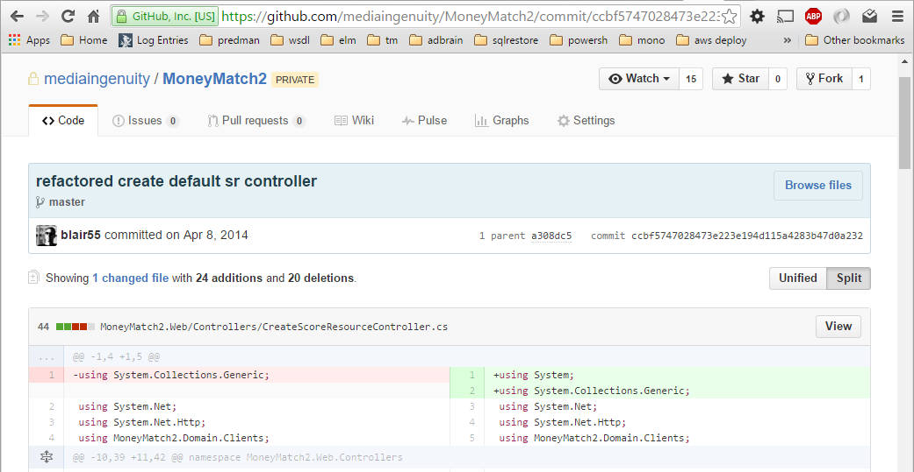
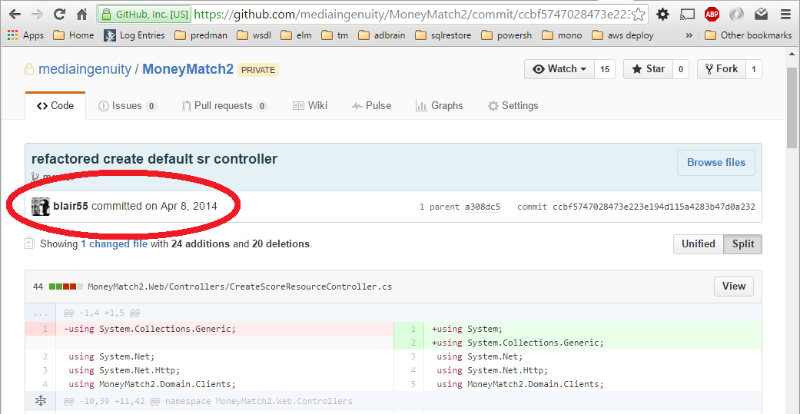

- title : Rules of Software
- author : Nick Blair
- theme : sky
- transition : default

***

*Some*

## Rules of Software Development

' not really about any work
' more like observations, not like tdd
' these rules come from software as I go through I'll try to apply them more generally to our business and in general
' hopefully you'll find it interesting

***

### Occam's Razor

> The simplest answer is usually correct

' quite popular, william of ockham 14th century
' more like an applicable rule or principle for problem solving
' if you have competing theories, first investigate the one with the least assumptions
' explain razor

***

- data-transition: fade

### Hanlon's Razor

> Don't attribute to malice what can be explained by stupidity

' extension of Occam's Razor
' never attribute to malice what can be explained by stupidity
' has to be remembered in software when people are asking for requirements or users creating errors
' but important because we have to work and get on with each other as people

---

- data-transition: fade

### Hanlon's Razor

> Cock-up before conspiracy

***

### Eagleson's Law

---

- data-transition: fade

*What idiot wrote this?*

---

- data-transition: fade

*What idiot wrote this?*

---

### Eagleson's Law

> Any code of your own that you haven't looked at for six or more months might as well have been written by someone else

' particularly pertinent
' documentation vs descriptive, declarative code
' don't make it difficult for the next person because it could be you

***

### Conway's Law

> Organisations which design systems ... are constrained to produce designs which are copies of the organisation

' Not necessarily a problem until your organisation becomes large & complex,
' large complex organisation = large complex software
' secret to large complex software is to build lots of small simple pieces
' organisations have to adopt modularity to achieve this
' netflix/amazon have small autonomous teams enforces modularity
' result is that they are very flexible
' break the problem down

***

### Parkinson's Law

> Work expands so as to fill the time available for its completion

' Student effect
' and then some

***

### Hofstadter's Law

> It always takes longer than you expect, even when you take into account Hofstadter's Law

' Planning Fallacy / 90-90
' recursive

---

### Agile

> Learn as you go

' agile way is to try to be more reactive
' don't plan too far in advance
' get real feedback

---

### Simplicity

> The art of maximizing the amount of work not done

---

> I would have written a shorter letter, but I did not have the time

*Pascal*

' french mathematician
' paradoxical

---

> Brevity is the soul of wit

*Shakespeare*

***

### Dunning-Kruger Effect

' cognitive bias
' overestimate your ability
' fail to recognise your own lack of skill
' bad because

---

### Imposter Syndrome

' feeling that someone will find you out
' underestimate your ability
' even in the face of evidence
' bad because

---

' confident? be cautious
' how developers get IS
' IS? you definitely aren't DK

***

### Conclusions

---

> Cock-up before conspiracy

---

> Small teams decompose the problem

---

> Don't plan too far ahead

---

> Life-long learning

***

### Fin.

' http://www.exceptionnotfound.net/fundamental-laws-of-software-development/
' https://en.wikipedia.org/wiki/List_of_eponymous_laws
' https://www.thoughtworks.com/insights/blog/demystifying-conways-law

***
